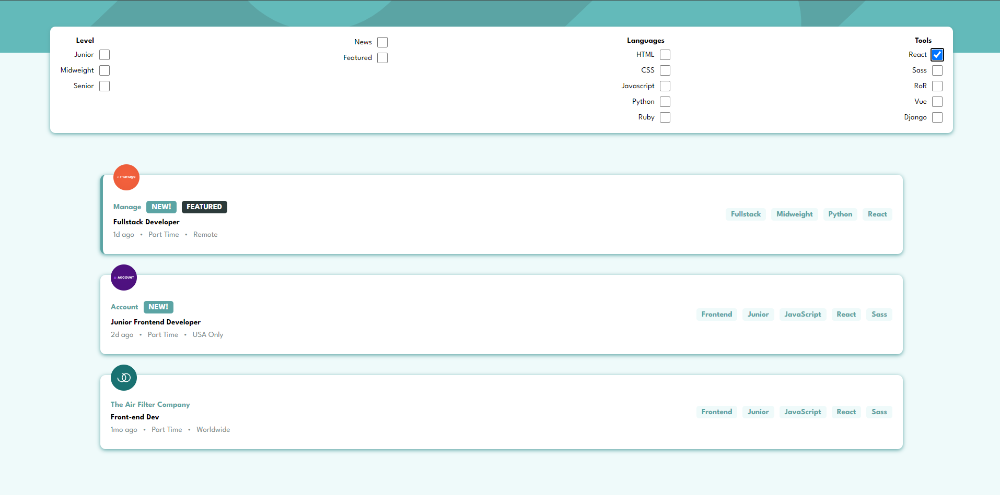

# Frontend Mentor - Job listings with filtering solution

Projet réalisé dans le cadre de ma formation à BeCode. Ce projet avait pour objectif d'apprendre quelques notions d'Angular. Ceci est une solution au challenge [Job listings with filtering challenge on Frontend Mentor](https://www.frontendmentor.io/challenges/job-listings-with-filtering-ivstIPCt).

## Table of contents

- [Overview](#overview)
  - [The challenge](#the-challenge)
  - [Screenshot](#screenshot)
  - [Links](#links)
- [My process](#my-process)
  - [Built with](#built-with)
  - [What I learned](#what-i-learned)
  - [Continued development](#continued-development)
  - [Useful resources](#useful-resources)
- [Author](#author)
- [Acknowledgments](#acknowledgments)

## Overview

### The challenge

Les utilisateurs doivent pouvoir

- Visualiser la mise en page optimale du site en fonction de la taille de l'écran de leur appareil
- Filtrer les offres d'emploi en fonction des catégories

### Screenshot

## My process

### Built with

- Angular
- Semantic HTML5 markup
- SCSS custom properties
- Flexbox
- Mobile-first workflow

## Author

- Github: [Dylan Feys](https://github.com/HappyFeys)

## Remarque

Filtre à continuer à travailler ... Lorsque je filtre, cela fonctionne. Par contre, si je retire un filtre, il ne remet pas les précédentes, sauf si tous les filtres sont retiré.
